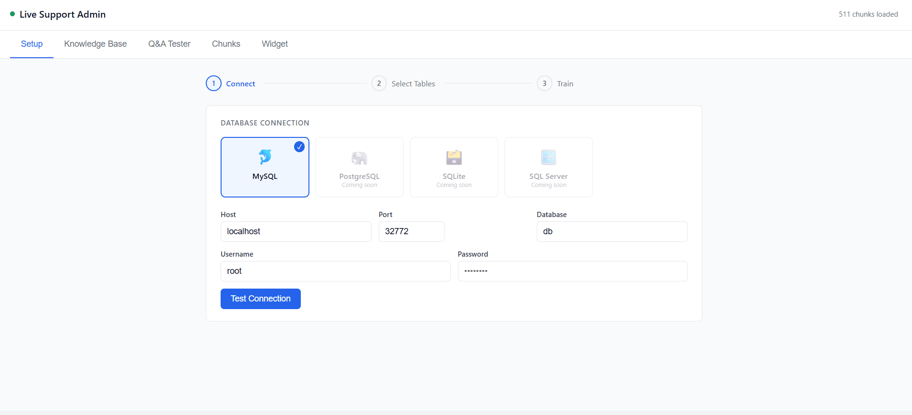

# Local AI Knowledge Base

Ask natural-language questions about your data in plain English.
Trains once from your database, then answers fully offline — no cloud APIs, no data leaves your machine.



## Stack

| Layer | Tech |
|---|---|
| Embeddings | sentence-transformers (`all-MiniLM-L6-v2`) |
| Vector DB | FAISS (cosine similarity) |
| LLM | Ollama (llama3.2 / mistral / phi3) |
| API | FastAPI + Uvicorn |
| Frontend | Vanilla JS widget (zero dependencies) |

## Supported Databases

| Provider | Status |
|---|---|
| MySQL | ✅ Available |
| PostgreSQL | 🔜 Coming soon |
| SQLite | 🔜 Coming soon |
| SQL Server | 🔜 Coming soon |

---

## Quick Start

### 1. Create a virtual environment and install dependencies

```bash
python3 -m venv .venv
source .venv/bin/activate        # Windows: .venv\Scripts\activate
pip install -r requirements.txt
```

> Activate the venv (`source .venv/bin/activate`) in every new terminal.

### 2. Install & start Ollama

```bash
# Install: https://ollama.com
ollama pull llama3.2   # ~2 GB download, one-time
ollama serve           # keep running in a terminal
```

### 3. Start the server

```bash
python app.py
# Server runs at http://localhost:8000
```

### 4. Set up your knowledge base (Admin Panel)

Open **http://localhost:8000/static/admin.html** and use the **Setup** tab:

1. Select your database provider
2. Enter connection credentials and click **Test Connection**
3. Choose which tables to include (all shown, none selected by default)
4. Click **Start Training** — progress streams live in the panel
5. Done — no restart needed, the knowledge base is hot-loaded

> The database is only accessed during training. After that the server runs fully offline.

### 5. Use the widget

Open `frontend/index.html` in a browser, or embed the widget on any page:

```html
<script src="http://localhost:8000/static/chat-widget.js"></script>
<script>
  ChatWidget.init({
    apiUrl:       "http://localhost:8000/ask",
    title:        "AI Assistant",
    primaryColor: "#4F46E5",
  });
</script>
```

---

## CLI Training (alternative to Admin Panel)

```bash
# Train all tables
python train.py --db_user=root --db_pass=YOUR_PASSWORD --db_name=mydb

# Include only specific tables
python train.py ... --tables products,orders,categories

# Exclude sensitive tables
python train.py ... --exclude users,sessions,payments

# Rebuild after data changes
python train.py ... --retrain

# List available tables
python train.py ... --list_tables
```

---

## API

### `POST /ask`

```json
// Request
{ "question": "How many active users are there?", "top_k": 5 }

// Response
{ "answer": "There are 42 active users.", "sources_count": 3, "latency_ms": 1240.5 }
```

### `GET /health`

```json
{ "status": "ok", "index_loaded": true, "chunks_count": 1250 }
```

### `POST /setup/connect`

Test credentials and return table list.

```json
// Request
{ "provider": "mysql", "host": "localhost", "port": 3306,
  "user": "root", "password": "...", "database": "mydb" }

// Response
{ "ok": true, "database": "mydb", "tables": [{"name": "users", "row_count": 5234}, ...] }
```

### `POST /setup/train`

Start background training for selected tables.

```json
// Request
{ "tables": ["users", "products", "orders"] }
```

### `GET /setup/status`

Poll for training progress.

```json
{ "status": "running", "progress": 70, "log": ["[12:01:05] Extracting 3 tables…", ...] }
```

### `GET /chunks?limit=20&offset=0`

Browse raw indexed chunks (debug).

Interactive docs at `http://localhost:8000/docs`

---

## Widget Options

```js
ChatWidget.init({
  apiUrl:       "http://localhost:8000/ask",  // backend URL
  title:        "AI Assistant",               // header text
  placeholder:  "Ask a question…",            // input placeholder
  primaryColor: "#4F46E5",                    // any CSS colour
  position:     "bottom-right",               // or "bottom-left"
  top_k:        5,                            // context chunks per query
});
```

---

## Project Structure

```
├── app.py                  FastAPI server (vector mode)
├── db_app.py               FastAPI server (direct DB / Text-to-SQL mode)
├── train.py                CLI: extract → embed → save index
├── requirements.txt
├── .env.example
│
├── db/
│   ├── providers/
│   │   ├── __init__.py     Factory: get_provider("mysql", ...)
│   │   ├── base.py         Abstract DatabaseProvider interface
│   │   └── mysql.py        MySQL implementation
│   ├── extractor.py        Schema + data extraction logic
│   └── direct_query.py     Live query executor (direct DB mode)
│
├── embeddings/
│   └── vector_store.py     FAISS build / save / load / search
│
├── llm/
│   ├── model.py            Ollama wrapper (vector mode)
│   └── sql_agent.py        Text-to-SQL agent (direct DB mode)
│
├── api/
│   ├── routes.py           /ask  /health  /chunks
│   ├── setup_routes.py     /setup/connect  /setup/train  /setup/status  /setup/config
│   └── direct_routes.py    Direct DB mode endpoints
│
├── cache/
│   └── query_cache.py      Persistent query cache (TTL-based)
│
├── data/
│   ├── raw/                Raw JSON schema snapshots (timestamped)
│   ├── processed/          Natural-language documents
│   ├── vectors/            faiss.index + chunks.json
│   ├── cache/              Cached query responses
│   └── sample_data.sql     Sample schema + data for testing
│
└── frontend/
    ├── chat-widget.js      Embeddable floating chat widget
    ├── index.html          Demo page
    └── admin.html          Admin panel (setup, KB stats, tester, chunks)
```

---

## Environment Variables

Copy `.env.example` to `.env`:

```
OLLAMA_BASE_URL=http://localhost:11434
OLLAMA_MODEL=llama3.2          # or: mistral, phi3, llama3.1
OLLAMA_TIMEOUT=300             # seconds (increase for large models on CPU)
OLLAMA_KEEP_ALIVE=10m          # keep model in RAM between requests
PORT=8000
HOST=0.0.0.0
LOG_LEVEL=info
```

---

## Changing the LLM Model

Any model available in Ollama works:

```bash
ollama pull mistral
OLLAMA_MODEL=mistral python app.py
```

Recommended models:

| Model | Size | Notes |
|---|---|---|
| `llama3.2` | 3B | Best speed/quality balance, default |
| `phi3` | 3.8B | Fast, good for factual Q&A |
| `mistral` | 7B | Stronger reasoning, needs ~5 GB RAM |

---

## Adding a New Database Provider

1. Create `db/providers/yourdb.py` implementing `DatabaseProvider`
2. Add one entry in `db/providers/__init__.py` → `get_provider()`
3. Add the provider card in `frontend/admin.html` (remove the `disabled` class)
